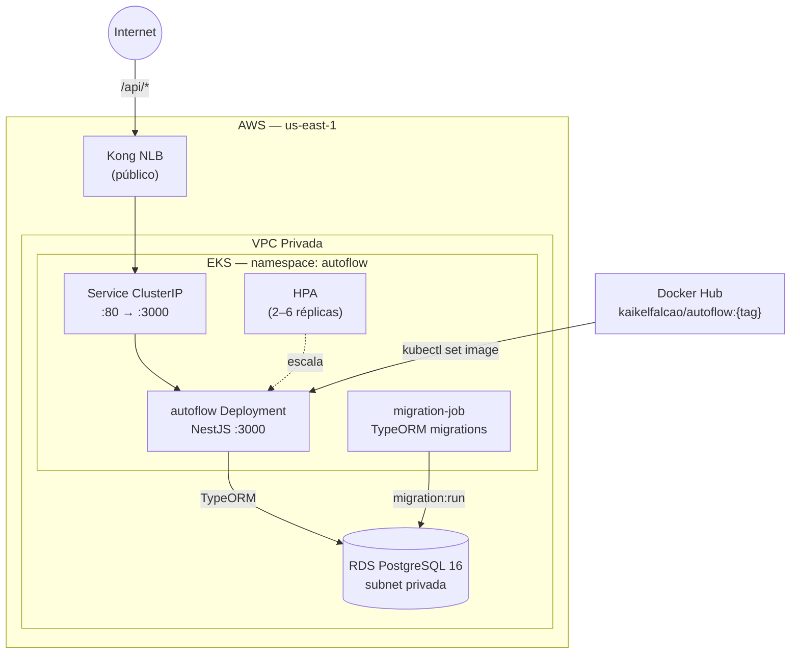

# autoflow — codebase

API de gestão de oficina mecânica do **AutoFlow**, desenvolvida com NestJS e
TypeScript seguindo Clean Architecture. Gerencia clientes, veículos, estoque,
catálogo de serviços e ordens de serviço.

## Tecnologias

| Camada          | Tecnologia              |
| --------------- | ----------------------- |
| Runtime         | Node.js 20              |
| Framework       | NestJS 11 + TypeScript 5|
| Banco de dados  | PostgreSQL 16 via TypeORM|
| Containerização | Docker / Docker Compose |
| Orquestração    | Kubernetes (EKS)        |
| Observabilidade | New Relic APM           |
| CI/CD           | GitHub Actions          |
| Imagem          | Docker Hub (`kaikelfalcao/autoflow`) |

## Arquitetura



## Posição no fluxo multi-repo

```
1. k8s  (Fase 1)  →  cria EKS, namespace autoflow, kubernetes_secret app-secrets
2. db             →  cria RDS
3. lambda         →  deploya função de auth (usada pelo Kong)
4. k8s  (Fase 2)  →  configura rotas Kong (/auth → lambda, /api/* → este app)
5. codebase (este)→  lê DB do state db via S3, builda imagem, deploya no EKS
```

O pipeline (`ci-cd.yml`) lê automaticamente do S3:
- `db-infra/terraform.tfstate` → `db_address`, `db_name`, `db_username`, `db_password`

E cria/atualiza o Kubernetes Secret `autoflow-secrets` no namespace `autoflow`
combinando os valores do S3 com `JWT_SECRET` e `NEWRELIC_LICENSE_KEY` do GitHub.

## Documentação da API

A coleção completa de requisições está disponível no **Bruno** (REST client):

```
docs/Bruno/
  catalog/        ← endpoints de catálogo de produtos e serviços
  customer/       ← endpoints de clientes
  health/         ← /api/health, /liveness, /readiness
  iam/            ← endpoints de identity & access management
  inventory/      ← endpoints de estoque
  service-order/  ← endpoints de ordens de serviço
  vehicle/        ← endpoints de veículos
```

Para usar: instale o [Bruno](https://www.usebruno.com/), abra a pasta
`docs/Bruno/` como coleção e configure a variável `baseUrl` com o endpoint
do Kong ou `http://localhost:3000` para desenvolvimento local.

### Endpoints principais

| Módulo        | Prefixo           | Descrição                             |
| ------------- | ----------------- | ------------------------------------- |
| IAM           | `/api/iam`        | Usuários e permissões                 |
| Customer      | `/api/customers`  | Cadastro de clientes                  |
| Vehicle       | `/api/vehicles`   | Veículos dos clientes                 |
| Catalog       | `/api/catalog`    | Produtos e serviços do catálogo       |
| Inventory     | `/api/inventory`  | Controle de estoque                   |
| Service Order | `/api/service-orders` | Ordens de serviço e transições   |
| Health        | `/api/health`     | Status da aplicação                   |

> Todas as rotas (exceto `/api/health`, `/liveness`, `/readiness`) requerem
> `Authorization: Bearer <token>` obtido via `POST /auth` no Kong.

## Documentação Arquitetural

Documentação completa em [`docs/architecture/`](docs/architecture/README.md):

- [Diagrama de Componentes](docs/architecture/components.md)
- [Fluxo de Autenticação](docs/architecture/sequences/auth-flow.md)
- [Fluxo de Ordem de Serviço](docs/architecture/sequences/service-order-flow.md)
- [RFCs](docs/architecture/README.md#rfcs--request-for-comments) — Cloud, Banco, Auth
- [ADRs](docs/architecture/README.md#adrs--architecture-decision-records) — Clean Arch, Kong, HPA, JSONB
- [Diagrama ER](docs/architecture/database/er-diagram.md)

## Estrutura

```
src/
  main.ts             ← bootstrap NestJS (prefixo /api, validação, logger)
  app.module.ts       ← módulo raiz (ConfigModule, TypeORM, features)
  shared/             ← entidades base, value objects, exceções de domínio
  modules/
    catalog/          ← catálogo de produtos e serviços
    customer/         ← gestão de clientes
    iam/              ← identity & access management
    inventory/        ← controle de estoque
    service-order/    ← ordens de serviço e transições de status
    vehicle/          ← veículos dos clientes

k8s/
  namespace.yaml      ← namespace autoflow
  secret.yaml         ← TEMPLATE — o pipeline cria o secret dinamicamente
  deployment.yaml     ← 2 réplicas, liveness/readiness probes, New Relic
  service.yaml        ← ClusterIP porta 80 → 3000
  hpa.yaml            ← escala de 2 a 6 réplicas (CPU 70%, mem 80%)
  migration-job.yaml  ← Job TypeORM migrations (roda antes do rollout)

docs/
  Bruno/              ← coleção de requisições REST (Bruno client)
  architecture/       ← componentes, sequências, ER diagram, ADRs, RFCs

.github/workflows/
  ci.yml              ← lint + format + test (push/PR para main e develop)
  ci-cd.yml           ← build Docker + push + deploy EKS (push de tags v*.*.*)
```

## Secrets no GitHub

| Secret                  | Descrição                                         |
| ----------------------- | ------------------------------------------------- |
| `AWS_ACCESS_KEY_ID`     | Credencial AWS Lab                                |
| `AWS_SECRET_ACCESS_KEY` | Credencial AWS Lab                                |
| `AWS_SESSION_TOKEN`     | Session token (obrigatório no Lab, expira em ~4h) |
| `JWT_SECRET`            | Segredo JWT da aplicação                          |
| `NEWRELIC_LICENSE_KEY`  | Chave de ingest New Relic                         |
| `DOCKER_USERNAME`       | Login Docker Hub (para push da imagem)            |
| `DOCKER_PASSWORD`       | Token Docker Hub                                  |

`DB_HOST`, `DB_PASS` e demais credenciais de banco **não são secrets** —
lidos automaticamente do state S3 pelo pipeline.

## CI/CD

| Evento               | Comportamento                                            |
| -------------------- | -------------------------------------------------------- |
| Push/PR em `main`    | lint + format:check + testes                             |
| Push de tag `v*.*.*` | Testa → build + push Docker → deploy EKS (com approval)  |

### Fluxo do deploy (`ci-cd.yml`)

1. **test** — lint, format check, testes unitários
2. **docker** — `docker build` multi-stage, push para `kaikelfalcao/autoflow:{tag}`
3. **deploy**:
   - Configura `kubectl` para o cluster `fiap-tc-dev-eks`
   - Lê credenciais DB do state S3 (`db-infra/terraform.tfstate`)
   - Cria/atualiza Secret `autoflow-secrets` no namespace `autoflow`
   - Aplica manifests (`namespace`, `deployment`, `service`, `hpa`)
   - Roda migrations via Job (`migration-job.yaml`)
   - `kubectl set image` + `kubectl rollout status`
   - Smoke test via Kong

## Desenvolvimento local

### Opção 1 — Docker Compose (mais simples)

Sobe o app completo com banco local:

```bash
cp .env.example .env
docker compose up -d
```

A API fica disponível em `http://localhost:3000/api`.

Para modo dev com hot reload:

```bash
npm ci
cp .env.example .env
docker compose up -d autoflow-db   # só o banco
npm run start:dev
```

### Opção 2 — Apontando para o RDS de dev (AWS Lab)

Útil para testar com dados reais. Requer que os repos k8s e db estejam deployados.

```bash
# Configure as credenciais AWS em .env.local.aws (veja .env.local.aws.example)
./scripts/local-env.sh   # gera .env com valores reais do RDS
npm run start:dev
```

> O RDS só aceita conexões de dentro da VPC. Use um bastion host ou
> `kubectl port-forward` para acessar externamente.

### Testes

```bash
npm run test          # unitários
npm run test:cov      # com cobertura
npm run test:e2e      # end-to-end
npm run lint
npm run format:check
```

### Migrations

```bash
npm run migration:generate -- src/modules/<modulo>/migrations/<NomeMigration>
npm run migration:run
npm run migration:revert   # desfaz a última migration
```

## Deploy manual no EKS

Para deployar sem a pipeline (usando as credenciais locais do Lab):

```bash
# 1. Configure kubectl
aws eks update-kubeconfig --region us-east-1 --name fiap-tc-dev-eks

# 2. Leia as credenciais do banco do S3
ACCOUNT_ID=$(aws sts get-caller-identity --query Account --output text)
BUCKET="fiap-tc-tfstate-${ACCOUNT_ID}"
aws s3 cp "s3://${BUCKET}/db-infra/terraform.tfstate" /tmp/db.tfstate
DB_HOST=$(jq -r '.outputs.db_address.value'   /tmp/db.tfstate)
DB_NAME=$(jq -r '.outputs.db_name.value'      /tmp/db.tfstate)
DB_USER=$(jq -r '.outputs.db_username.value'  /tmp/db.tfstate)
DB_PASS=$(jq -r '.outputs.db_password.value'  /tmp/db.tfstate)

# 3. Crie/atualize o secret
kubectl create secret generic autoflow-secrets -n autoflow \
  --from-literal=NODE_ENV=production \
  --from-literal=DB_HOST="${DB_HOST}" \
  --from-literal=DB_PORT=5432 \
  --from-literal=DB_USER="${DB_USER}" \
  --from-literal=DB_PASS="${DB_PASS}" \
  --from-literal=DB_NAME="${DB_NAME}" \
  --from-literal=JWT_SECRET="${JWT_SECRET}" \
  --from-literal=JWT_EXPIRES_IN=1d \
  --from-literal=NEW_RELIC_ENABLED=true \
  --from-literal=NEW_RELIC_APP_NAME=autoflow-tc \
  --from-literal=NEW_RELIC_LICENSE_KEY="${NEWRELIC_LICENSE_KEY}" \
  --from-literal=NEW_RELIC_LOG_LEVEL=info \
  --dry-run=client -o yaml | kubectl apply -f -

# 4. Aplique os manifests
kubectl apply -f k8s/namespace.yaml
kubectl apply -f k8s/deployment.yaml
kubectl apply -f k8s/service.yaml
kubectl apply -f k8s/hpa.yaml

# 5. Atualize a imagem
kubectl set image deployment/autoflow \
  autoflow=kaikelfalcao/autoflow:latest -n autoflow
kubectl rollout status deployment/autoflow -n autoflow
```

## Observações

- O `k8s/secret.yaml` é um **template de documentação** — não contém valores reais e não é aplicado pela pipeline. O secret real é criado via `kubectl create secret --dry-run=client`. Nunca commite credenciais reais nesse arquivo.
- O session token AWS expira em ~4h — atualize antes de cada deploy manual.
- O HPA escala de 2 a 6 réplicas com base em CPU (70%) e memória (80%).

## Autores

- João Miguel
- Kaike Falcão
- Matheus Hurtado
- Thalita Silva
